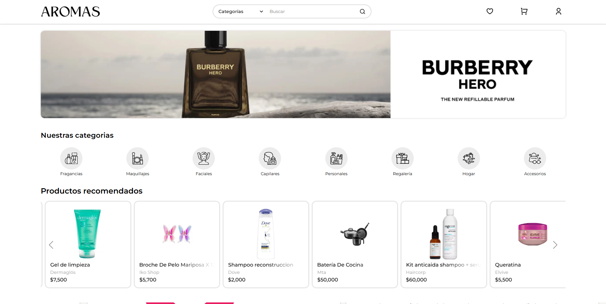
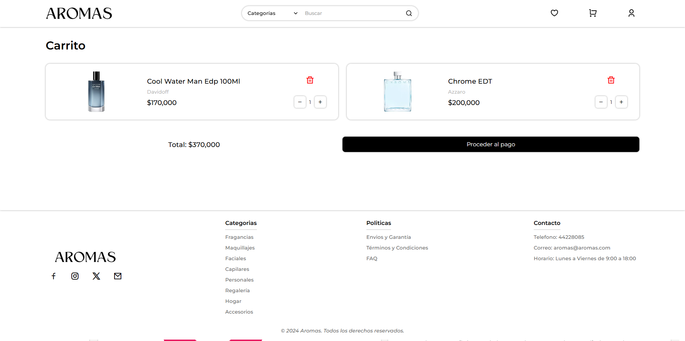
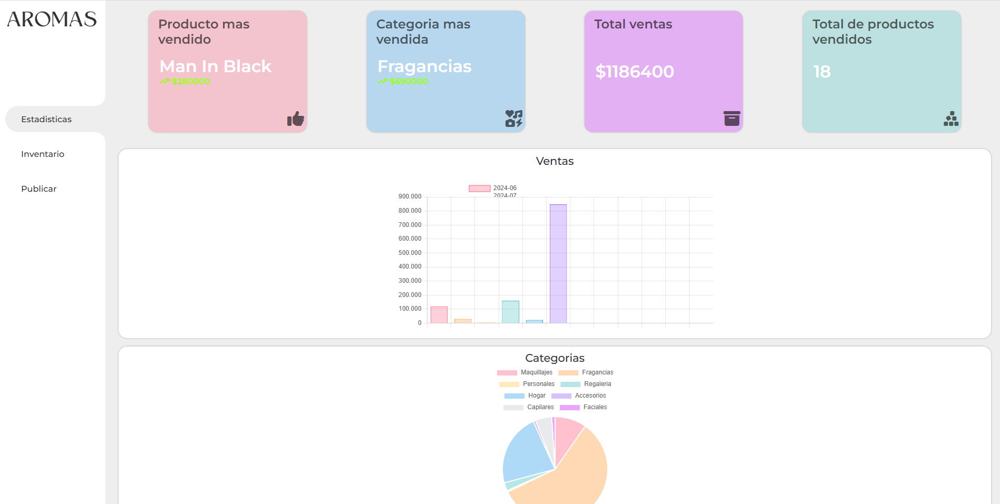

# Proyecto Aromas

## ¿Qué problema resuelve?
Plataforma de e-commerce pensada para negocios de fragancias y cuidado personal que necesitan exhibir productos, gestionar carritos, favoritos y pedidos, y contar con un panel admin sencillo para altas, bajas y modificaciones sin depender de desarrollos adicionales.

## Stack técnico usado
- Frontend: HTML5, CSS3 (estilos propios), JavaScript (Swiper para sliders, Remixicon, fuentes Google).
- Backend: PHP 8+ con sesiones e integración directa a MySQL mediante `mysqli`.
- Base de datos: MySQL (`bd/aromas2.sql` define la estructura y datos iniciales).
- Otros: Chart.js para analíticas en el panel admin, imágenes estáticas en `media/` y uploads en `php/admin_folder/img_productos/`.

## Instrucciones para correrlo local
1) Requisitos: PHP 8+, MySQL/MariaDB, y un entorno tipo Laragon/XAMPP (o `php -S`).
2) Clona el repositorio en tu directorio web (ej. `c:\laragon\www\ProyectoPP2024`).
3) Crea la base `aromas2` y importa `bd/aromas2.sql` desde phpMyAdmin o consola (`mysql -u root -p aromas2 < bd/aromas2.sql`).
4) Ajusta credenciales en `php/db.php` si tu usuario/contraseña difieren de `root` sin contraseña.
5) Levanta el servidor apuntando al directorio `php` como raíz: `php -S localhost:8000 -t php` o configura Apache/Nginx en tu stack local.
6) Abre `http://localhost/proyectopp2024/php/index.php`  y prueba el flujo de navegación, login y carrito.

## Screenshots o diagramas
- Home: 
- Favoritos: 
- Carrito: 
- Panel Admin: 
